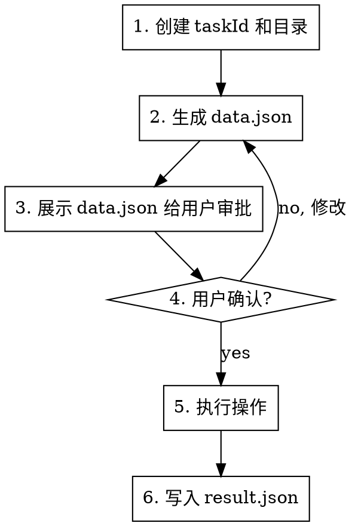

# hzero-il8n

h0 平台多语言管理工具。支持查询、新增、修改、删除多语言条目，AI 翻译，代码多语言问题检查，以及生成 Excel/CSV 文件。

> **每日首次使用本 skill 前，自动执行更新检查（每天一次，详见「每日更新检查」）。**

## When to Use

- 需要管理 h0 平台多语言配置时
- 需要检查代码中的多语言问题时
- 需要批量翻译多语言时
- 需要生成多语言 Excel/CSV 文件时
- 需要从 Excel/CSV 导入多语言时

## Setup

导入 skill 后，运行以下命令注册 `/hzero-il8n-*` 命令到 opencode：

```bash
# Windows CMD
setup.bat

# PowerShell
.\setup.ps1
```

或手动复制 `commands/` 目录下的文件到 `~/.config/opencode/commands/`。

注册后重启 opencode 即可使用 `/il8n-*` 命令。

## Quick Reference

| 命令 | 说明 | 关键参数 |
|------|------|----------|
| `/hzero-il8n-query` | 查询多语言 | promptKey, promptCode, description |
| `/hzero-il8n-add` | 新增多语言 | promptKey, promptCode, promptConfigs |
| `/hzero-il8n-modify` | 修改多语言 | promptId, objectVersionNumber, _token, promptConfigs |
| `/hzero-il8n-delete` | 删除多语言 | promptId, objectVersionNumber, _token |
| `/hzero-il8n-check` | 检查代码多语言问题 | 文件/目录路径 |
| `/hzero-il8n-translate` | AI 翻译未翻译条目 | promptKey, 目标语言 |
| `/hzero-il8n-export` | 生成 Excel/CSV | promptKey, 格式(xlsx/csv) |
| `/hzero-il8n-import` | 从文件导入 | 文件路径 |
| `/hzero-il8n-update` | 检查 skill 版本更新 | 分支(可选,默认master) |

## Environment Setup

首次使用时检查 `hzero-il8n/.env.json`，如果 `projects` 为空则引导用户配置：

```json
{
  "projects": {
    "项目名": {
      "defaultLanguage": "zh_CN",
      "environments": {
        "dev": {
          "host": "http://开发环境地址",
          "token": "bearer xxx",
          "tenantId": 0
        }
      }
    }
  },
  "currentProject": "项目名",
  "currentEnvironment": "dev",
  "fileProjectMap": {}
}
```

**Token 要求：** 必须有 0 租户平台层权限。

### 默认语言探测（defaultLanguage）

配置项目时，**AI 自行探索项目源码**，抽样读取页面/组件文件中的 `intl.get(...).d('...')` 调用，统计 `.d()` 默认值的中英文占比，推断默认语言：

- 抽样范围：项目源码目录（如 `src/`）下的页面/组件 `.js`/`.jsx`/`.tsx` 文件，跳过 `node_modules`/`dist`/`.umi` 等
- 判定：默认值含中文（CJK）记为中文，否则记为英文；中文占比高 -> `zh_CN`，英文占比高 -> `en_US`
- `defaultLanguage` 用于新增条目时 `.d()` 默认值的语言、检查/翻译时的主语言等
- 将结果存入 `.env.json` 对应项目的 `defaultLanguage` 字段，并向用户说明推断依据（抽样数量与占比）

### 项目关联（fileProjectMap）

`fileProjectMap` 记录文件/目录与项目的关联关系。当用户操作一个文件时，AI 需要：

1. 检查 `fileProjectMap` 中是否已有该文件的关联
2. 如果没有，询问用户该项目对应的项目名和环境
3. 记录到 `fileProjectMap` 中，格式：`{ "文件路径": { "project": "项目名", "environment": "环境名" } }`
4. 后续操作该文件时自动使用关联的项目配置

**示例：**

```json
{
  "fileProjectMap": {
    "D:\\Mine\\Projects\\Work\\hskp-front-console\\packages\\hskp-front-console-platform": {
      "project": "hskp-console",
      "environment": "dev"
    },
    "D:\\Mine\\Projects\\Work\\hskp-another-console": {
      "project": "hskp-another",
      "environment": "test"
    }
  }
}
```

切换项目时，根据文件路径自动匹配正确的项目配置，不会混淆。

## Token 校验

每次操作前必须校验 token 有效性：

```javascript
const { validateToken } = require('./scripts/utils');
const result = await validateToken();
if (!result.valid) {
  // 要求用户提供新 token
}
```

## 每日更新检查

**每天首次使用本 skill 时，必须先执行每日更新检查（每天仅一次）。检查为 cache-first：先读 `cache.json` 的 `lastCheckDate`，若为今天则直接返回 `skip-already-checked`，不调用网络接口；仅当今日未检查过时才调用接口。**（用户手动要求重新检查时用强制检查，见下文。）

> 手动执行 `/hzero-il8n-update` 命令为**强制检查**（`node scripts/update.js`，始终联网，不读 cache 判断是否跳过），但检查后写入 `lastCheckDate`；本节 cache-first（读 cache 判断是否跳过）仅适用于每日自动检查。

```javascript
const { checkDailyUpdate } = require('./scripts/update');
const r = await checkDailyUpdate();        // 默认 master 分支，cache-first（每日自动检查用）
```

或直接运行：`node scripts/update.js --daily`（cache-first，每日自动检查）/ `node scripts/update.js`（强制检查，手动命令用，不读 cache 但写入 lastCheckDate）

返回 `action` 决定后续行为：

| action | 含义 | AI 行为 |
|--------|------|---------|
| `skip-already-checked` | 今日已检查过 | 不提示，直接继续用户任务 |
| `up-to-date` | 已是最新 | 不提示，直接继续 |
| `skip-skipped-version` | 有更新但用户已跳过该版本 | 不提示，直接继续 |
| `update-available` | 发现新版本 | 用 `question` 工具提示用户选择 |
| `check-failed` | 检查失败（网络等） | 仅提示用户检查失败，不阻塞，直接继续用户任务（今日不再检查） |

检查状态记录在 `cache.json`（`lastCheckDate` / `skippedVersion`）。`checkDailyUpdate` 在执行当天首次检查时即写入 `lastCheckDate`，**无论成功或失败当天都不再重复检查**。

**`update-available` 时的三个选项：**
- **立即更新**：执行 `git pull` 与 `npm install`，再运行 `.\setup.ps1`（或 `setup.bat`）重新注册命令（新增/修改的命令才会生效），提示用户重启 AI 工具
- **跳过此版本**：运行 `node scripts/update.js --skip <latest>` 记录跳过，本次不再提示（直到出现更新的版本）
- **稍后再说**：本次不更新，明天首次使用时再次提示

**用户明确要求重新检查时**（如「重新检查更新」「强制检查」）：运行 `node scripts/update.js [分支]`（强制检查，不读写 cache，始终联网）。

`cache.json` 为本地文件（已加入 `.gitignore`），不应提交到仓库。

## Task Management

**每次操作必须按以下顺序执行，不可跳过任何步骤。**

### Step 1: 创建 taskId 和目录

```javascript
const { generateTaskId, createTaskDir } = require('./scripts/utils');

const taskId = generateTaskId('operation-name');
// taskId 格式: task-{名称}-{年}-{月}-{日}-{时}-{分}-{秒}
// 示例: task-check-domain-2026-07-12-19-23-58

const taskDir = createTaskDir(taskId);
```

> Step 1 完成后，在 `{taskId}/task.md` 写入任务信息与流程清单（全部 `[ ]`）。执行过程逐一打勾，Step 2 后填待执行数据摘要，Step 6 后填执行结果摘要（详见下方「强制流程」）。

### Step 2: 生成 data.json

将所有待执行的操作写入 `{taskId}/data.json`：

```javascript
const { writeDataTaskDir } = require('./scripts/utils');

writeDataTaskDir(taskDir, 'data.json', {
  action: 'check',
  // ... 完整的操作数据
});
```

### Step 3: 展示给用户审批

**必须将 data.json 的完整内容展示给用户审批**，不能省略、不能摘要，**严格以列表/表格形式逐条展示，每条必须列出 `promptKey` 与 `promptCode`**。data.json 仅展示，用户不直接修改。

### Step 4: 用户确认后执行

使用 `question` 工具让用户选择（确认执行/跳过/要求 AI 修改）。用户要求修改时，由 AI 修改 data.json 后再次展示审批，确认后才能执行。

### Step 5: 写入 result.json

操作完成后将结果写入 `{taskId}/result.json`，并将执行结果摘要追加写入 `{taskId}/task.md`，同时把流程清单全部打勾 `[✓]`。

## API Usage

```javascript
const api = require('./scripts/api');

// 查询（自动根据 fileProjectMap 确定项目，或手动指定）
const list = await api.getPromptList({ promptKey: 'hskp.common', size: 0, project: 'hskp-console', environment: 'dev' });

// 新增
await api.insertPrompt({ promptKey: '...', promptCode: '...', promptConfigs: {...} }, 'hskp-console', 'dev');

// 修改
await api.updatePrompt({ promptId: '...', objectVersionNumber: 1, _token: '...', promptConfigs: {...} }, 'hskp-console', 'dev');

// 删除（⚠️ 必须逐条审批，用户明确要求才能调用）
await api.deletePrompt({ promptId: '...', objectVersionNumber: 1, _token: '...', promptKey: '...', promptCode: '...', lang: 'zh_CN', description: '...', tenantId: 0, langDescription: '中文(简体)' }, 'hskp-console', 'dev');

// 验证更新是否生效（查询）
const updated = await api.getPromptList({ promptKey: '...', promptCode: '...', project: 'hskp-console', environment: 'dev' });

// 根据文件路径获取关联项目
const projectInfo = api.getProjectByFilePath('D:\\Mine\\Projects\\Work\\hskp-front-console\\packages\\...');
// => { project: 'hskp-console', environment: 'dev' }
```

## File Generation

```javascript
const { generateExcel, parseExcel } = require('./scripts/excel');
const { generateCsv, parseCsv } = require('./scripts/csv');

// 生成 Excel
generateExcel(prompts, path.join(taskDir, 'output.xlsx'));

// 生成 CSV
generateCsv(prompts, path.join(taskDir, 'output.csv'));

// 解析文件
const data = parseExcel('path/to/file.xlsx');
```

## promptCode Generation

```javascript
const { generatePromptCode } = require('./scripts/utils');

// 从页面文件夹名推导
const code = generatePromptCode('DataManage', 'button', 'create');
// => "dataManage.button.create"
```

规则：1-5 段，camelCase，融合模块/视图信息。

**promptKey 约束：** promptKey 必须为两段格式 `{xxx}.{xxx}`（如 `hsop.common`、`hskp.platform`），新增多语言时必须校验，不符合则拒绝并提示用户。

## Constraints

**违反以下任何一条都视为流程违规，必须立即停止并纠正。**

### 强制流程（每次操作必须严格按顺序执行）



**每步打勾确认（严格按顺序，未确认不得进入下一步）：在 `{taskId}/task.md` 中维护以下流程清单，每完成一步将对应 `[ ]` 改为 `[✓]` 并在该步后写结果摘要，保存。**

- [ ] Step 1：创建 taskId 和目录，并在 task.md 写入任务信息与流程清单
- [ ] Step 2：生成 data.json，并在 task.md 填写待执行数据摘要
- [ ] Step 3：展示 data.json 完整内容给用户审批
- [ ] Step 4：用户确认（question 工具）
- [ ] Step 5：执行操作
- [ ] Step 6：写入 result.json，并在 task.md 填写执行结果摘要

**`task.md` 模板（Step 1 创建，过程逐一打勾，Step 6 填结果摘要）：**

```markdown
# 任务: {taskId}

- 操作类型: query/add/modify/delete/check/translate/export/import
- 项目/环境: {project} / {environment}
- 创建时间: {ISO}

## 执行流程（每完成一步打勾并写结果摘要）

- [ ] Step 1: 创建 taskId 和目录 — 结果：
- [ ] Step 2: 生成 data.json — 结果：
- [ ] Step 3: 展示 data.json 给用户审批 — 结果：
- [ ] Step 4: 用户确认（question 工具）— 结果：
- [ ] Step 5: 执行操作 — 结果：
- [ ] Step 6: 写入 result.json — 结果：

## 待执行数据摘要
（Step 2 后填写：操作类型、条目数、关键内容）

## 执行结果摘要
（Step 6 后填写：成功/失败、处理条数、验证结果等）
```


**Step 1:** 必须先调用 `generateTaskId()` 创建 taskId，再调用 `createTaskDir()` 创建目录，然后在 `{taskId}/task.md` 写入任务信息（taskId、操作类型、项目/环境、创建时间）与上述流程清单（全部 `[ ]`）。

**Step 2:** 将所有待执行的操作写入 `{taskId}/data.json`，包括：
- 操作类型（query/add/modify/delete/check/translate/export/import）
- 完整的数据内容（不是摘要）
- 对于 check 操作：列出所有发现的问题，每个问题包含行号、类型、当前值、建议值

**Step 3:** 必须将 data.json 的完整内容展示给用户审批，**不能省略、不能摘要、不能只展示部分，严格以列表/表格逐条展示，且每条必须列出 `promptKey` 与 `promptCode`**。data.json 仅展示给用户，用户不直接修改。

**Step 4:** 使用 `question` 工具让用户选择（确认执行/跳过/要求 AI 修改）。若用户要求修改，**由 AI 修改 data.json 后再次展示审批**，用户不直接编辑 data.json。

**Step 5:** 用户确认后才能执行操作。

**Step 6:** 操作完成后将结果写入 `{taskId}/result.json`，并将执行结果摘要（成功/失败、处理条数、验证结果等）追加写入 `{taskId}/task.md` 的「执行结果摘要」章节，同时把 Step 6 打勾 `[✓]`。

### taskId 格式

`task-{名称}-{年}-{月}-{日}-{时}-{分}-{秒}`

示例: `task-check-domain-2026-07-12-19-23-58`

**禁止在 taskId 中使用冒号 `:`**，Windows 不允许目录名包含冒号。

### 其他约束

1. 首次使用必须配置 `.env.json`
2. 每次操作前校验 token 有效性
3. Token 必须有 0 租户平台层权限
4. Token 过期时要求用户提供新 token
5. **新增或修改多语言后，必须调用 API 同步到平台**（insertPrompt/updatePrompt），不能只生成本地文件
6. **新增或修改后，必须调用查询接口（getPromptList）验证更新是否生效**，不需要刷新缓存
7. 操作文件前必须检查 `fileProjectMap` 确认关联项目，防止项目混淆
8. **`currentProject` 和 `currentEnvironment` 由 AI 根据 fileProjectMap 自动决定**，不能让用户手动切换
9. **删除操作（deletePrompt）必须满足以下全部条件才能执行：**
   - 用户明确要求删除（必须包含"删除"或"delete"关键字）
   - 删除操作必须逐条审批，每条删除单独询问用户确认
   - 必须向用户展示被删除条目的完整信息（promptKey, promptCode, zh_CN, en_US 等）
   - 用户确认后才能调用 deletePrompt API
   - **禁止批量删除，必须一条一条审批**
   - **如果用户只是提到"删除"但没有明确要求执行删除操作（如讨论删除逻辑），不得调用删除接口**
10. **新增多语言 key 的正确流程（必须按顺序执行）：**
    - Step 0: 校验 promptKey 为两段格式 `{xxx}.{xxx}`，不符合则拒绝并提示用户
    - Step 1: 查询平台确认 key 不存在
    - Step 2: 修改代码文件
    - Step 3: 展示 data.json 给用户审批（列出 promptKey 与 promptCode）
    - Step 4: 用户确认后，调用 insertPrompt 新增到平台
    - Step 5: 调用查询接口验证新增是否生效
    - **禁止先新增平台再修改代码，必须先确认平台无此 key**

### Red Flags - 必须停止

- 未创建 taskId 就开始操作
- 未生成 data.json 就直接执行
- 未展示 data.json 就询问用户确认
- data.json 内容被省略或摘要
- 用户未确认就执行增删改操作
- 操作完成后未写入 result.json
- taskId 中使用冒号
- 操作文件前未检查 fileProjectMap 确认关联项目
- 新增或修改后未查询验证更新是否生效
- 未经用户明确要求就调用 deletePrompt
- 批量删除多语言条目（必须逐条审批）
- **先新增平台再修改代码（必须先修改代码再新增平台）**
- 未在每步完成后于 `task.md` 打勾确认就进入下一步
- 未在任务目录创建 `task.md`，或未在 `task.md` 写入执行结果摘要
- 新增多语言时 promptKey 不符合两段格式 `{xxx}.{xxx}`
- 让用户直接修改 data.json（应由 AI 修改后重新提交审批）
- 展示 data.json 时未列出 promptKey 与 promptCode

## Code Check (check)

扫描代码文件中的 `intl.get()` 调用，检查：
- 未注册的 key（平台上不存在）
- 未使用的 key（代码中未引用）
- 翻译缺失（promptConfigs 缺少某些语言）
- code 格式违规
- 英文大小写规范（见下）
- intl.get 作用域（不能在组件外直接调用，见下）

### 英文大小写规范

检查 `en_US` 值的大小写是否符合以下规则，发现问题需在 data.json 中列出当前值与建议值。

**标题类（Title Case — 每个英文单词首字母大写）：**
- 适用：页面标题、弹窗/抽屉标题、表格列标题、分区标题、按钮、菜单项、标签页、面包屑文字
- 判断依据：promptCode 含 `title`/`header`/`column`/`button`/`tab`/`menu`/`breadcrumb` 等关键词，或上下文为短词组（≤5 词、无常句结构）
- 示例：`Create User` ✓ / `Create user` ✗ / `create user` ✗

**描述类（Sentence Case — 仅句首及专有名词大写）：**
- 适用：帮助信息、提示语、占位符、说明性描述、完整句子
- 判断依据：上下文为完整句子或长描述，或 promptCode 含 `tip`/`help`/`placeholder`/`description`/`message` 等关键词
- 示例：`Please enter your username to log in.` ✓ / `Please Enter Your Username To Log In.` ✗

**例外：** 专有名词（产品名）、缩写（API/URL/ID）、品牌名保持原大写；占位符 `{user}` 等不受规则影响。无法确定归属时，按上下文语义判断并向用户说明理由。

### intl.get 作用域检查

`intl.get()` 不能在组件/函数外直接调用（模块顶层）。文件 import 时常量中的 `intl.get` 会在多语言数据加载前执行，此时只能拿到 `.d()` 默认值或 key，而非真实翻译。

**违规（模块顶层，import 时即执行）：**

```javascript
const COLUMNS = [
  { title: intl.get('hsop.common.name').d('名称') },
  { title: intl.get('hsop.common.operate').d('操作') },
];
```

**建议改为函数或 getter，组件使用时再调用：**

```javascript
const getColumns = () => [
  { title: intl.get('hsop.common.name').d('名称') },
  { title: intl.get('hsop.common.operate').d('操作') },
];
```

检查时识别模块作用域（顶层 `const`/`let`/`var`、对象/数组字面量内、非函数体）的 `intl.get` 调用，列入 data.json 并建议改为函数/getter。

### 检查项选择（多选）

**检查开始前**，先用 `question` 工具（`multiple: true`）列出检查项（首个为「全部」），让用户**多选**要执行哪些检查：

- 全部（执行以下所有检查）
- 硬编码字符串
- 未注册的 key（平台上不存在）
- 翻译缺失（promptConfigs 缺少某些语言）
- code 格式违规
- 英文大小写规范
- intl.get 作用域

用户选「全部」时执行所有检查项；否则仅对选中的项执行，未选中的跳过。检查完成后将所有发现问题写入 data.json，并**严格以列表逐条展示**（每条问题含位置/类型/当前值/建议值，不得用段落叙述或省略）。

注意：**只有 `hzero.common` 是自动加载的**，项目自定义的 common promptKey（如 `hskp.common`）需要在 `formatterCollections` 的 `code` 数组中显式声明。

```javascript
const { parseIntlGetCalls, parseFullIntlCode } = require('./scripts/utils');
```

## Batch Query

使用 `size=0` 查询某个 promptKey 下的所有多语言：

```javascript
const all = await api.getPromptList({ promptKey: 'hskp.platform', size: 0 });
```

## 特殊项目多语言文档

部分项目前端不基于 h0 但后端基于 h0，多语言机制与通用规范（`doc/intl.md`）不同。这类项目的专属说明放在 `doc/{project}/` 下：

- `doc/openplatform/README.md`：开放平台（hsop-front-app-openplatform）多语言说明

**操作某项目前（根据 `fileProjectMap` 确定项目），若 `doc/{project}/` 存在，必须先阅读其说明并以其为准**，通用 `doc/intl.md` 仅作补充。新增特殊项目时，在 `doc/` 下新建 `{project}/` 子目录并补充说明。

## File Reference

- `scripts/api.js`: API 调用封装
- `scripts/utils.js`: 工具函数
- `scripts/excel.js`: Excel 生成/解析
- `scripts/csv.js`: CSV 生成/解析
- `scripts/update.js`: 版本更新检查
- `doc/h0.md`: h0 平台规范
- `doc/intl.md`: h0 多语言规范
- `doc/openplatform/README.md`: 开放平台多语言说明（特殊项目）
