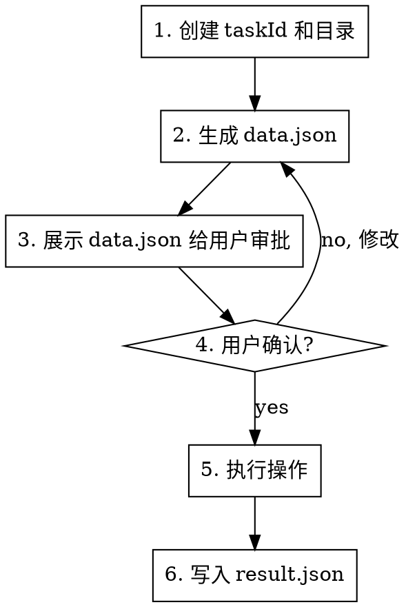

# hzero-il8n

h0 平台多语言管理工具。支持查询、新增、修改、删除多语言条目，AI 翻译，代码多语言问题检查，以及生成 Excel/CSV 文件。

## When to Use

- 需要管理 h0 平台多语言配置时
- 需要检查代码中的多语言问题时
- 需要批量翻译多语言时
- 需要生成多语言 Excel/CSV 文件时
- 需要从 Excel/CSV 导入多语言时

## Setup

导入 skill 后，运行以下命令注册 `/hzero-il8n-*` 命令到 opencode：

```bash
# Windows CMD
setup.bat

# PowerShell
.\setup.ps1
```

或手动复制 `commands/` 目录下的文件到 `~/.config/opencode/commands/`。

注册后重启 opencode 即可使用 `/il8n-*` 命令。

## Quick Reference

| 命令 | 说明 | 关键参数 |
|------|------|----------|
| `/hzero-il8n-query` | 查询多语言 | promptKey, promptCode, description |
| `/hzero-il8n-add` | 新增多语言 | promptKey, promptCode, promptConfigs |
| `/hzero-il8n-modify` | 修改多语言 | promptId, objectVersionNumber, _token, promptConfigs |
| `/hzero-il8n-delete` | 删除多语言 | promptId, objectVersionNumber, _token |
| `/hzero-il8n-check` | 检查代码多语言问题 | 文件/目录路径 |
| `/hzero-il8n-translate` | AI 翻译未翻译条目 | promptKey, 目标语言 |
| `/hzero-il8n-export` | 生成 Excel/CSV | promptKey, 格式(xlsx/csv) |
| `/hzero-il8n-import` | 从文件导入 | 文件路径 |

## Environment Setup

首次使用时检查 `hzero-il8n/.env.json`，如果 `projects` 为空则引导用户配置：

```json
{
  "projects": {
    "项目名": {
      "environments": {
        "dev": {
          "host": "http://开发环境地址",
          "token": "bearer xxx",
          "tenantId": 0
        }
      }
    }
  },
  "currentProject": "项目名",
  "currentEnvironment": "dev",
  "fileProjectMap": {}
}
```

**Token 要求：** 必须有 0 租户平台层权限。

### 项目关联（fileProjectMap）

`fileProjectMap` 记录文件/目录与项目的关联关系。当用户操作一个文件时，AI 需要：

1. 检查 `fileProjectMap` 中是否已有该文件的关联
2. 如果没有，询问用户该项目对应的项目名和环境
3. 记录到 `fileProjectMap` 中，格式：`{ "文件路径": { "project": "项目名", "environment": "环境名" } }`
4. 后续操作该文件时自动使用关联的项目配置

**示例：**

```json
{
  "fileProjectMap": {
    "D:\\Mine\\Projects\\Work\\hskp-front-console\\packages\\hskp-front-console-platform": {
      "project": "hskp-console",
      "environment": "dev"
    },
    "D:\\Mine\\Projects\\Work\\hskp-another-console": {
      "project": "hskp-another",
      "environment": "test"
    }
  }
}
```

切换项目时，根据文件路径自动匹配正确的项目配置，不会混淆。

## Token 校验

每次操作前必须校验 token 有效性：

```javascript
const { validateToken } = require('./scripts/utils');
const result = await validateToken();
if (!result.valid) {
  // 要求用户提供新 token
}
```

## Task Management

**每次操作必须按以下顺序执行，不可跳过任何步骤。**

### Step 1: 创建 taskId 和目录

```javascript
const { generateTaskId, createTaskDir } = require('./scripts/utils');

const taskId = generateTaskId('operation-name');
// taskId 格式: task-{名称}-{年}-{月}-{日}-{时}-{分}-{秒}
// 示例: task-check-domain-2026-07-12-19-23-58

const taskDir = createTaskDir(taskId);
```

### Step 2: 生成 data.json

将所有待执行的操作写入 `{taskId}/data.json`：

```javascript
const { writeDataTaskDir } = require('./scripts/utils');

writeDataTaskDir(taskDir, 'data.json', {
  action: 'check',
  // ... 完整的操作数据
});
```

### Step 3: 展示给用户审批

**必须将 data.json 的完整内容展示给用户**，不能省略、不能摘要。

### Step 4: 用户确认后执行

使用 `question` 工具让用户选择，确认后才能执行。

### Step 5: 写入 result.json

操作完成后将结果写入 `{taskId}/result.json`。

## API Usage

```javascript
const api = require('./scripts/api');

// 查询（自动根据 fileProjectMap 确定项目，或手动指定）
const list = await api.getPromptList({ promptKey: 'hskp.common', size: 0, project: 'hskp-console', environment: 'dev' });

// 新增
await api.insertPrompt({ promptKey: '...', promptCode: '...', promptConfigs: {...} }, 'hskp-console', 'dev');

// 修改
await api.updatePrompt({ promptId: '...', objectVersionNumber: 1, _token: '...', promptConfigs: {...} }, 'hskp-console', 'dev');

// 删除（⚠️ 必须逐条审批，用户明确要求才能调用）
await api.deletePrompt({ promptId: '...', objectVersionNumber: 1, _token: '...', promptKey: '...', promptCode: '...', lang: 'zh_CN', description: '...', tenantId: 0, langDescription: '中文(简体)' }, 'hskp-console', 'dev');

// 验证更新是否生效（查询）
const updated = await api.getPromptList({ promptKey: '...', promptCode: '...', project: 'hskp-console', environment: 'dev' });

// 根据文件路径获取关联项目
const projectInfo = api.getProjectByFilePath('D:\\Mine\\Projects\\Work\\hskp-front-console\\packages\\...');
// => { project: 'hskp-console', environment: 'dev' }
```

## File Generation

```javascript
const { generateExcel, parseExcel } = require('./scripts/excel');
const { generateCsv, parseCsv } = require('./scripts/csv');

// 生成 Excel
generateExcel(prompts, path.join(taskDir, 'output.xlsx'));

// 生成 CSV
generateCsv(prompts, path.join(taskDir, 'output.csv'));

// 解析文件
const data = parseExcel('path/to/file.xlsx');
```

## promptCode Generation

```javascript
const { generatePromptCode } = require('./scripts/utils');

// 从页面文件夹名推导
const code = generatePromptCode('DataManage', 'button', 'create');
// => "dataManage.button.create"
```

规则：1-5 段，camelCase，融合模块/视图信息。

## Constraints

**违反以下任何一条都视为流程违规，必须立即停止并纠正。**

### 强制流程（每次操作必须严格按顺序执行）



**Step 1:** 必须先调用 `generateTaskId()` 创建 taskId，再调用 `createTaskDir()` 创建目录。

**Step 2:** 将所有待执行的操作写入 `{taskId}/data.json`，包括：
- 操作类型（query/add/modify/delete/check/translate/export/import）
- 完整的数据内容（不是摘要）
- 对于 check 操作：列出所有发现的问题，每个问题包含行号、类型、当前值、建议值

**Step 3:** 必须将 data.json 的完整内容展示给用户，**不能省略、不能摘要、不能只展示部分**。

**Step 4:** 使用 `question` 工具让用户选择操作（修复/跳过/修改）。

**Step 5:** 用户确认后才能执行操作。

**Step 6:** 操作完成后将结果写入 `{taskId}/result.json`。

### taskId 格式

`task-{名称}-{年}-{月}-{日}-{时}-{分}-{秒}`

示例: `task-check-domain-2026-07-12-19-23-58`

**禁止在 taskId 中使用冒号 `:`**，Windows 不允许目录名包含冒号。

### 其他约束

1. 首次使用必须配置 `.env.json`
2. 每次操作前校验 token 有效性
3. Token 必须有 0 租户平台层权限
4. Token 过期时要求用户提供新 token
5. **新增或修改多语言后，必须调用 API 同步到平台**（insertPrompt/updatePrompt），不能只生成本地文件
6. **新增或修改后，必须调用查询接口（getPromptList）验证更新是否生效**，不需要刷新缓存
7. 操作文件前必须检查 `fileProjectMap` 确认关联项目，防止项目混淆
8. **`currentProject` 和 `currentEnvironment` 由 AI 根据 fileProjectMap 自动决定**，不能让用户手动切换
9. **删除操作（deletePrompt）必须满足以下全部条件才能执行：**
   - 用户明确要求删除（必须包含"删除"或"delete"关键字）
   - 删除操作必须逐条审批，每条删除单独询问用户确认
   - 必须向用户展示被删除条目的完整信息（promptKey, promptCode, zh_CN, en_US 等）
   - 用户确认后才能调用 deletePrompt API
   - **禁止批量删除，必须一条一条审批**
   - **如果用户只是提到"删除"但没有明确要求执行删除操作（如讨论删除逻辑），不得调用删除接口**
10. **新增多语言 key 的正确流程（必须按顺序执行）：**
    - Step 1: 查询平台确认 key 不存在
    - Step 2: 修改代码文件
    - Step 3: 展示 data.json 给用户审批
    - Step 4: 用户确认后，调用 insertPrompt 新增到平台
    - Step 5: 调用查询接口验证新增是否生效
    - **禁止先新增平台再修改代码，必须先确认平台无此 key**

### Red Flags - 必须停止

- 未创建 taskId 就开始操作
- 未生成 data.json 就直接执行
- 未展示 data.json 就询问用户确认
- data.json 内容被省略或摘要
- 用户未确认就执行增删改操作
- 操作完成后未写入 result.json
- taskId 中使用冒号
- 操作文件前未检查 fileProjectMap 确认关联项目
- 新增或修改后未查询验证更新是否生效
- 未经用户明确要求就调用 deletePrompt
- 批量删除多语言条目（必须逐条审批）
- **先新增平台再修改代码（必须先修改代码再新增平台）**

## Code Check (check)

扫描代码文件中的 `intl.get()` 调用，检查：
- 未注册的 key（平台上不存在）
- 未使用的 key（代码中未引用）
- 翻译缺失（promptConfigs 缺少某些语言）
- code 格式违规

注意：**只有 `hzero.common` 是自动加载的**，项目自定义的 common promptKey（如 `hskp.common`）需要在 `formatterCollections` 的 `code` 数组中显式声明。

```javascript
const { parseIntlGetCalls, parseFullIntlCode } = require('./scripts/utils');
```

## Batch Query

使用 `size=0` 查询某个 promptKey 下的所有多语言：

```javascript
const all = await api.getPromptList({ promptKey: 'hskp.platform', size: 0 });
```

## File Reference

- `scripts/api.js`: API 调用封装
- `scripts/utils.js`: 工具函数
- `scripts/excel.js`: Excel 生成/解析
- `scripts/csv.js`: CSV 生成/解析
- `doc/h0.md`: h0 平台规范
- `doc/intl.md`: h0 多语言规范
